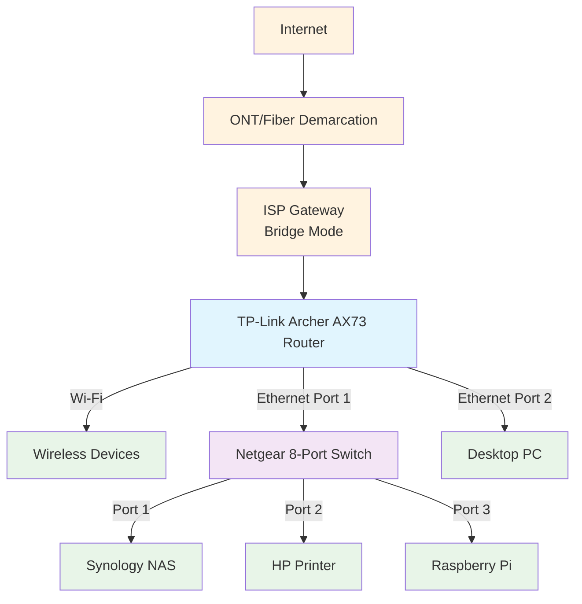
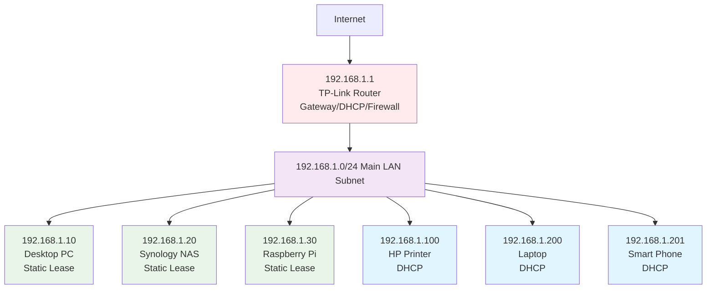

# Home Network Documentation

**Author:** [Yihan Liu]  
**Last Updated:** [2025/11/23]  
**Repository Purpose:** To document the physical and logical design, addressing, and configuration of my home network for management, troubleshooting, and security purposes.

---

## 1. Physical and Logical Topologies

### 1.1. Physical Network Topology

The physical topology represents how devices are physically connected via cables and wireless signals.

### 1.2. Logical Network Topology

The logical topology shows how data flows based on IP subnets and VLANs (Virtual Local Area Networks). This network uses a simple flat structure with a single subnet.

## 2. Addressing Documentation

### 2.1. IPv4 Subnet
- **Network Address:** `192.168.1.0`
- **Subnet Mask:** `255.255.255.0` (`/24`)
- **Usable Host Range:** `192.168.1.1` - `192.168.1.254`
- **Total Usable Hosts:** 254

### 2.2. Key Network Devices & Static IP Assignments

| Device | MAC Address | IP Address | Assignment Method | Purpose |
| :--- | :--- | :--- | :--- | :--- |
| **TP-Link Router** | `[Router MAC]` | `192.168.1.1` | Static (Hardcoded) | Default Gateway, DNS, DHCP Server |
| **Desktop PC** | `[PC MAC]` | `192.168.1.10` | Static DHCP Lease | Primary Workstation |
| **Synology NAS** | `[NAS MAC]` | `192.168.1.20` | Static DHCP Lease | File Storage, Media Server |
| **Raspberry Pi** | `[Pi MAC]` | `192.168.1.30` | Static DHCP Lease | Pi-hole (Network-wide Ad-blocking) |
| **HP Printer** | `[Printer MAC]` | `192.168.1.100` | DHCP | Network Printing |

### 2.3. DHCP Scope
- **DHCP Server:** TP-Link Router
- **Pool Range:** `192.168.1.101` - `192.168.1.199`
- **Lease Time:** 120 minutes
- **DNS Servers:** `192.168.1.30` (Pi-hole), `1.1.1.1` (Cloudflare - Fallback)

---

## 3. Network Devices and Servers/Services

| Device/Service | Role & Function | OS/Software |
| :--- | :--- | :--- |
| **ISP Gateway** | Modem/Bridge | ISP Proprietary |
| **TP-Link AX73** | Core Router, Firewall, Switch, AP | TP-Link OEM Firmware |
| **Netgear Switch** | Layer 2 Switch | OEM Firmware |
| **Synology DS220+** | Network-Attached Storage | DSM 7.x |
| **Raspberry Pi 4** | Lightweight Server | Raspberry Pi OS (Lite) |
| **Pi-hole** | Network-wide Ad-blocker & DNS Sinkhole | Pi-hole Software |
| **Desktop PC** | Primary Workstation | Windows 11 Pro |

---

## 4. Devices Configurations

### 4.1. Core Router (TP-Link AX73)
- **SSID:** `HomeNetwork-5G`, `HomeNetwork-2.4G`
- **Wireless Security:** WPA2/WPA3-Personal
- **Firewall:** Enabled. Default deny on WAN ingress. Port forwarding configured for specific services (e.g., WireGuard VPN port `51820`).
- **Admin Access:** HTTPs only; Local network access only.

### 4.2. Raspberry Pi (Pi-hole)
- **Primary Service:** Pi-hole configured as the primary DNS server for the network.
- **Blocklists:** Default lists + one additional security list.
- **Web Interface:** Accessible via `http://192.168.1.30/admin/`.

### 4.3. Synology NAS
- **Services Enabled:** SMB/CIFS for file sharing, DLNA Media Server, Hyper Backup.
- **Security:** Auto-block IP after 5 failed login attempts. 2-Factor Authentication (2FA) enabled for all user accounts.
- **Updates:** Automatic security updates enabled.

---

## 5. Secure Storage of Login Credentials

**Method Used: Password Manager (Bitwarden)**

All sensitive login credentials for network devices (Router, Switch, NAS, Pi, Cloud Services) are **securely stored in a Bitwarden vault**.

- **Master Password:** A strong, unique passphrase that is memorized and not stored digitally.
- **Two-Factor Authentication (2FA):** TOTP-based 2FA is enabled on the Bitwarden account itself, requiring a code from an authenticator app in addition to the master password for access.
- **Structure:** Each entry in Bitwarden contains the device/service name, URL, username, password, and the TOTP seed for generating 2FA codes. Secure notes are used for complex static configurations or recovery keys.

**Rationale:** This method provides a centralized, encrypted, and highly secure location for all credentials, accessible from any authorized device, while mitigating the risks of password reuse, weak passwords, and physical loss.
